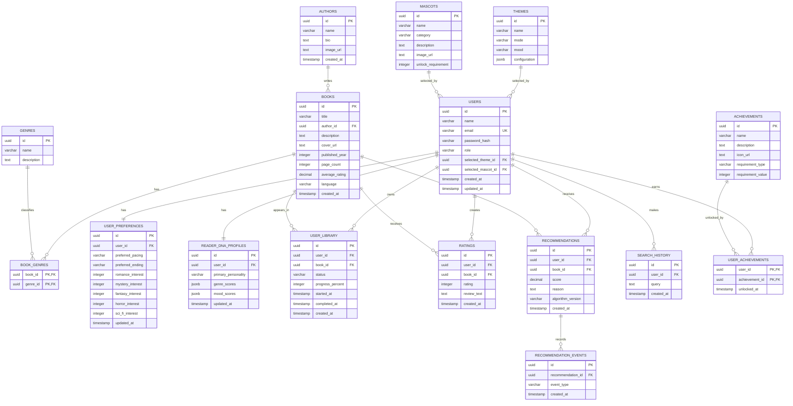

# BookDNA AI — ER Diagram



## Relationship Summary

* One author can write many books.
* A book can belong to multiple genres, and a genre can contain multiple books.
* Each user has one preference profile and one Reader DNA profile.
* A user can add many books to their library; each book can appear in many user libraries.
* A user can rate many books, and each book can receive many ratings.
* A user can receive many recommendations; each recommendation can generate multiple interaction events.
* A user can choose one theme and one mascot.
* Users can unlock multiple achievements.

```
```
